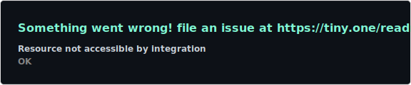

  

<h3 align="center">
⚙️ Senior Data Engineer • ☁️ Azure Databricks • 🔷 Microsoft Fabric • 🏗️ Lakehouse Architecture
</h3>

 
<table align="center">
  <tr>
    <td>
      
    </td>
    <td>
      
    </td>
  </tr>
</table>

 

  

 

  <h2>🚀 Sobre Mim</h2>
  

    Sou <b>Data Engineer</b> com 5+ anos construindo plataformas de dados escaláveis com <b>Azure Databricks</b>, <b>Microsoft Fabric</b> e <b>Medallion Architecture</b>. 
    Atuo na <b>Petrobras</b> (via Compass UOL), entregando pipelines ETL/ELT críticos, Data Lakehouses com <b>Delta Lake + Unity Catalog</b> e dashboards com Power BI e Streamlit.
  

  <table width="1000px">
    <tr>
      <td align="left">
        <ul>
          <li>🏗️ Especialista em <b>Medallion Architecture</b> (Bronze → Silver → Gold) e <b>Data Lakehouse</b> com Delta Lake e Unity Catalog.</li>
          <li>☁️ Certificado <b>Databricks Data Engineer Associate</b> e <b>DP-203 Azure Data Engineer</b> (2025).</li>
          <li>🎯 <b>Foco:</b> Azure Databricks · Microsoft Fabric · PySpark · DataOps · Data Governance.</li>
          <li>🌍 Aberto a oportunidades remotas no Brasil, Portugal, Europa e EUA.</li>
        </ul>
      </td>
    </tr>
  </table>

  <h2>&nbsp;Stack Principal</h2>

  
  
  
  
  
  

    

  

  <h2>📂 Projetos Destacados</h2>

  <table width="1000px">
    <tr>
      <td align="left">
        <ul>
          <li>
            <b><a href="https://github.com/Adrianogvs/projeto-nosql-iot">01: Pipeline IoT — Setor de Óleo & Gás</a></b> 
            Simulação de pipeline ponta a ponta para coleta, tratamento e análise de dados de sensores IoT em ambientes críticos — ingestão em tempo real com processamento distribuído.
          </li>
          <li>
            <b><a href="https://github.com/Adrianogvs/aws-weather-realtime-etl">02: Real-time ETL na AWS — Dados Climáticos</a></b> 
            Pipeline de ingestão, tratamento e análise de dados climáticos em tempo real com batch processing e notificações automáticas via AWS.
          </li>
          <li>
            <b><a href="https://github.com/Adrianogvs/002_Engenharia_de_Dados_Azure">03: Engenharia de Dados no Azure</a></b> 
            Projetos práticos com Azure Databricks, ADF, ADLS Gen2 e Medallion Architecture — do pipeline à camada analítica.
          </li>
          <li>
            <b><a href="https://github.com/Adrianogvs/007_CM_Capital">04: Extração e Análise de Dados Financeiros com Python</a></b> 
            Pipeline de extração de dados de PDFs e análise de mercado financeiro com Python e Jupyter Notebooks.
          </li>
        </ul>
      </td>
    </tr>
  </table>

  <h2>📜 Certificações</h2>

  <table width="1000px">
    <tr>
      <td align="left">
        <ul>
          <li>🏆 <b>Databricks Data Engineer Associate</b> (2025)</li>
          <li>🏆 <b>DP-600: Azure Fabric Analytics Engineer Associate</b> (2026)</li>
          <li>🏆 <b>DP-203: Azure Data Engineer Associate</b> (2025)</li>
          <li>🏆 <b>AI-102: Azure AI Engineer Associate</b> (2025)</li>
          <li>🏆 <b>PL-300: Power BI Data Analyst</b> (2025)</li>
        </ul>
      </td>
    </tr>
  </table>

  <h2>📫 Contato</h2>
  

    
    
    
  

   
  
   
  ⚡ <i>"Transformando dados em ativos estratégicos — da ingestão bruta ao insight governado."</i>

